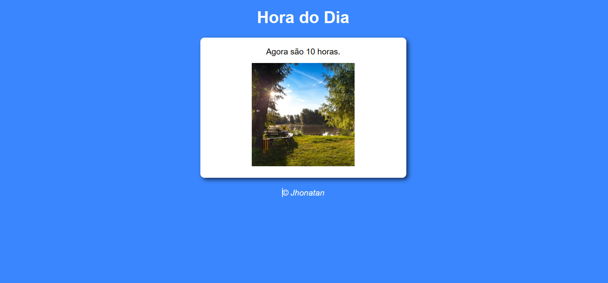

<h1 align="center"> Verificador de Hora </h1>

Projeto de verificação de hora dos dispositivo em que que está sendo acessado, com exibição da hora e de uma imagem referente ao periodo do dia, manhã, tarde ou noite. Desenvolvido com os conceitos de condicionais "IF" e "ELSE" usadas de forma composta. 

  
 

  

## 🚀 Tecnologias

Esse projeto foi desenvolvido com as seguintes tecnologias:

- HTML e CSS
- JavaScript
- Git e Github

## 💻 Projeto

- [Acesse o projeto finalizado, online](https://jhonatansilva90.github.io/Verificador-de-Idade/)